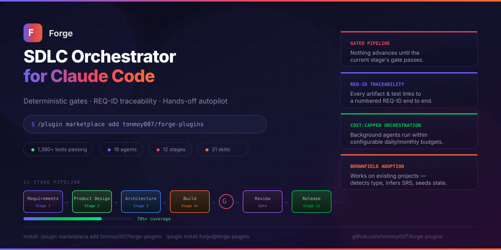
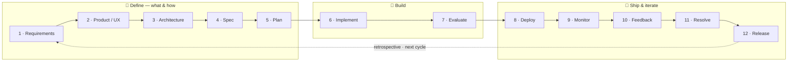
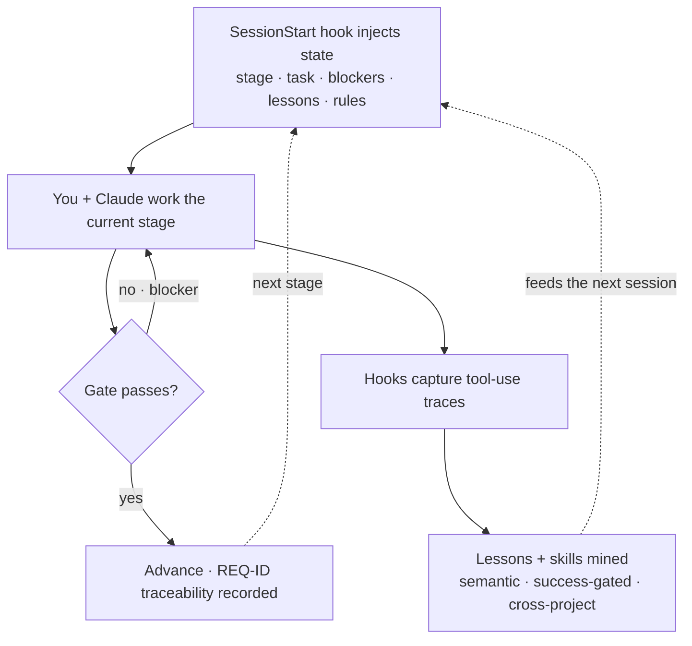
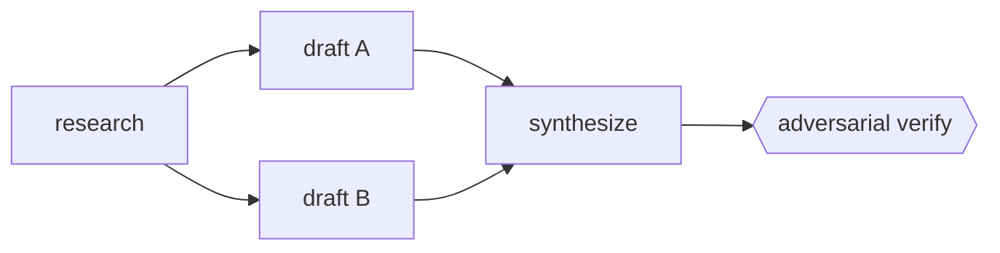

> **Forge turns Claude Code from a smart coding assistant into a disciplined engineering
> partner.** Claude already remembers — what it doesn't enforce is *process*. Forge does:
> gated stages, requirement traceability, and learning that compounds across projects.

[]()
[]()
[]()
[]()

---

## What is Forge?

A Claude Code plugin that adds the one thing a coding assistant lacks — **enforced
sequencing**. Forge gives you:

- **A gated 12-stage pipeline** — requirements → design → build → ship. Each stage
  **blocks until its gate passes**, and every artifact traces back to a numbered
  requirement: `REQ-NNN → gate → code → test`.
- **Learning that compounds** — tagged, filterable lessons and auto-mined skills that
  carry from one repo to the next, so your mistake rate drops over time.
- **A dynamic workflow engine** — run arbitrary **parallel agent DAGs** beyond the fixed
  pipeline, opt-in (new in v0.4.0).

Nothing advances silently and nothing is untraceable. When you *do* need to skip a gate,
`/forge:force-advance` records **why** — the override is explicit and audited.

---

## The pipeline at a glance



*Every arrow is a gate — work advances only when the previous stage's exit criteria pass.*

| Stage | Command | Output |
|-------|---------|--------|
| 1 — Requirements | `/forge:srs` | SRS with REQ-IDs |
| 2 — Product & UX | `/forge:product` | PRD, design system, user flows |
| 3 — Architecture | `/forge:arch` | Architecture doc, ADRs, data model |
| 4 — Technical Spec | `/forge:spec` | Tech spec, interface contracts, test strategy |
| 5 — Planning | `/forge:plan` | Task DAG, milestones, risk register |
| 6 — Implementation | `/forge:build` | Code, decisions log, progress tracker |
| 7 — Evaluation | `/forge:eval` | Test results, security review, eval report |
| 8 — Deployment | `/forge:deploy` | Deploy plan, runbook, deploy log |
| 9 — Monitoring | `/forge:monitor` | Observability config, incident log |
| 10 — Feedback | `/forge:feedback` | Feedback log, triage |
| 11 — Resolution | `/forge:resolve` | Hotfixes, regression tests, backlog |
| 12 — Release | `/forge:release` | Changelog, release notes, checklist |

---

## Install

In Claude Code:

```
/plugin marketplace add tonmoy007/forge-plugins
/plugin install forge@forge-plugins
```

**Prerequisites:** Claude Code ≥ 2.1.0 · Python ≥ 3.11 on PATH · `pip install pyyaml`.

---

## Quickstart (< 5 minutes)

```
/forge:init      # detect project type, scaffold pipeline/, write state.md
/forge:srs       # Claude interviews you → requirements with REQ-IDs
/forge:status    # "where am I?" — Forge tells you at every session start
```

Then run each `/forge:<stage>` in turn. You never track where you are — Forge injects the
current stage, task, and blockers into every session and always names the next step.

---

## How Forge works

Forge runs as **silent lifecycle hooks** around your normal Claude Code session. They inject
state at the start, enforce gates as you work, and quietly learn from what succeeds:



Three tiers of memory feed that loop:

1. **Session context** — injected at every `SessionStart` (≤ 2 000 tokens).
2. **Project memory** — `pipeline/` accumulates decisions, reflections, and stage history.
3. **Cross-project lessons** — `~/.forge/global-lessons.yaml` promotes high-frequency
   patterns across all your repos.

When a *successful* workflow recurs in your own traces, Forge mines it and **proposes a
reusable skill** for you to approve, modify, or reject. See
[`references/skill-mining.md`](references/skill-mining.md).

### 🎓 The graduation layer — memory that crosses projects

Forge promotes the best of **all three** memory kinds into a shared `~/.forge` store, so
every project benefits from what your other projects learned — automatically and silently at
session-start. Each tier promotes on a gate matched to its nature: **lessons** on cross-project
breadth, **skills** on quality (approved + ExpeL `weight > 0` + reused ≥ 2×), **workflows** on
proof (validates clean + ≥ 2 successful runs). On recall **your project always wins** — the
global store is a fallback library, never an override; skills are recalled as symlinks and a
shared 30-day TTL decays unused entries out of recall. `/forge:graduate --dry-run` previews,
`list` shows the store, and it's all fail-soft (`FORGE_NO_GRADUATE=1` to disable). Full
reference: [`references/graduation-layer.md`](references/graduation-layer.md).

---

## Beyond the pipeline

All capabilities below are **opt-in** — a project that never enables them behaves exactly
like the plain gated pipeline.

### 🤖 Autopilot — hands-off runs

`/forge:autopilot` runs stages back-to-back: run the stage agent → check the gate →
**advance only on a pass**. A blocking gate triggers a bounded **self-heal** (`/forge:resolve`,
then re-gate) instead of stopping; optional **self-verify** double-checks a pass with a
fresh-context verifier; `--unattended` removes checkpoints (recording explicit assumptions,
never silent guesses). Bounded by spend caps and stoppable any time.

```
/forge:autopilot              # current stage → end of cycle
/forge:autopilot to stage 7   # run through a target
/forge:autopilot --unattended # fully hands-free
/forge:autopilot-stop         # halt cleanly at the next boundary
```

Configure under `autopilot:` in `.forge/config.yaml` (per-stage model routing, budget,
self-heal, verify). Long runs survive context limits via checkpoint → compact → continue —
see [`references/autopilot-context.md`](references/autopilot-context.md).

### 🔀 Dynamic workflows — parallel agent DAGs

Beyond the linear pipeline, Forge has a general **workflow engine**: an arbitrary DAG of
heterogeneous agent steps with per-node prompts, `depends_on` edges, inter-step data passing,
and bounded parallel fan-out.



The engine is **always available** — Forge's own fan-outs (`/forge:review`, `/forge:adopt`,
`/forge:why`) run on it. Runs are deterministic (parallel and sequential outputs are
byte-identical) and never-raises (a dropped node is reported, never hidden). Enable the
capabilities in `.forge/config.yaml`:

```yaml
orchestration:
  flows_enabled: false           # /forge:flow + .forge/workflows/*.yaml
  parallel_build: false          # fan independent build tasks out in parallel
  worktree_isolation: false      # each parallel mutating node in its own git worktree
  allow_generated_subdags: false # the validated `decompose` sub-DAG node
  session_reuse: false           # within-node --resume of a node's own retry/heal (v0.6.0)
  max_parallel: 4                # max concurrent dispatches per wave
  max_total: 64                  # hard cap on total nodes per run
  max_budget_usd:                # optional admission ceiling (omit = no cap)
  narrate: true                  # live [Forge] stderr narration (off: FORGE_WF_QUIET=1)
```

The five capability toggles are **independent and default `false`** — with no `orchestration:`
block Forge behaves exactly as before. `narrate` is **not** a capability toggle: it only controls
the side-channel stderr narration and changes no engine behavior (the stdout result is
byte-identical with it on or off).

- **User-defined flows** (`flows_enabled`) — author `.forge/workflows/<name>.yaml`, then
  `/forge:flow <name>` (or `--plan` to preview the dependency waves + a **cost pre-flight
  estimate**). Output flows through the Proposal→Validator→Executor rails — nothing is written to
  your project unapproved. A worked example ships in-repo:
  [`.forge/workflows/doc-review.yaml`](.forge/workflows/doc-review.yaml) — a `split →
  {reviewer-a, reviewer-b} → synthesize` diamond.
- **Parallel build + worktree isolation** — the build stage fans independent task-DAG nodes
  out in parallel; each mutating node runs on its own `forge/wt/<node>` branch so conflicts
  surface loudly at the merge instead of clobbering.
- **Hybrid generation** (`allow_generated_subdags`) — a `decompose` node lets a cheap model
  generate a *sub-DAG*, validated (acyclicity + node-count + token budget) **before** any
  child runs.
- **Session reuse** (`session_reuse`, v0.6.0) — a node's **own** retry/heal re-dispatch
  `--resume`s the first attempt's session (same prompt + model), paying the cheaper resume
  floor instead of a second fresh floor. Cost-only: admission still charges the fresh floor, the
  independent verifier always runs fresh, and a stale session falls back to a fresh dispatch — so
  it never changes the admitted/dropped set (off ⇒ byte-identical to v0.4.x).

**Observable + predictable.** Every run narrates its waves, per-node start/done/dropped, and a
final id-ordered summary on **stderr** (`narrate`), appends exactly one structured
`workflow_run` line to `.forge/events.jsonl` (audit trail), and a pre-flight estimator surfaces
the spend estimate + which nodes drop under the cap **before** dispatch — all with zero change to
what the engine computes.

**Cost-sizing rule.** Each DAG node is a *fresh-session* `claude -p` dispatch and pays the
fresh-session floor (~`$0.06`/node); admission charges one floor per node against `max_total`,
`max_budget_usd`, and your daily/monthly cost cap. Size a run by `node_count × floor`: a 20-node
flow needs ~`$1.20` of headroom or the deterministic admission set drops the overflow (loudly).

Example `.forge/workflows/<name>.yaml` schema — a mapping with `name`, optional `description`, and
a `nodes` list; each node has an `id`, a `prompt` *or* a `{{upstream_id}}`-interpolating
`prompt_template`, optional `depends_on` / `schema` / `model`:

```yaml
name: doc-review
nodes:
  - id: split
    prompt: "Return JSON {\"sections\": [...]} for the target doc."
  - id: reviewer-a
    depends_on: [split]
    model: claude-haiku-4-5
    prompt_template: "Review these sections: {{split}} → JSON {findings:[...]}."
  - id: synthesize
    depends_on: [reviewer-a]
    prompt_template: "Merge {{reviewer-a}} into one deduped review."
```

Full reference: [`references/workflow-engine.md`](references/workflow-engine.md) ·
[`references/orchestration-config.md`](references/orchestration-config.md).

### 📋 Project rules

Author scoped constraints that steer Forge's agents (a Forge-native take on `.cursor/rules`).
Rules live in `.forge/rules/*.md` and are **advisory** by default — they surface as context,
never block — unless a glob rule sets `enforce: true` (then it hard-blocks writes to matching
paths, the guardrail that makes hands-off runs safe).

```
/forge:rules init     # scaffold .forge/rules/
/forge:rules add …    # add a rule from a template
/forge:rules list     # show active rules
```

Scopes: `always`, `stage`, `glob` (on matching writes), `manual`. Full schema:
[`references/rules-format.md`](references/rules-format.md).

### 🧩 Adaptive profiles

Forge detects your project type at init and tailors stages and gates:

`api` · `fullstack` · `ml-pipeline` · `cli` · `library` · `monorepo` · `mobile` ·
`data-contract`

Each adds type-specific steps and a real gate (e.g. monorepo → acyclic dependency-graph
gate; data-contract → schema-compatibility gate). Override with `/forge:set-profile <type>`.

### 🌙 Background daemons

Optional, cost-capped, capability-gated background agents (a clean no-op when unavailable):

| Command | Daemon |
|---------|--------|
| `/forge:watch` · `/forge:watch-stop` | **Observer** — records risky changes / missing tests / drift, surfaced at session start |
| `/forge:dreamer-run` | **Dreamer** — consolidates lessons (decay, dup & contradiction flagging, daily digest) |
| `/forge:health-check` | **Health** — hook + lesson-store integrity → `healthy / degraded / failing` |

See [`references/daemon-bus.md`](references/daemon-bus.md).

---

## Command reference

**Pipeline:** `/forge:srs` `/forge:product` `/forge:arch` `/forge:spec` `/forge:plan`
`/forge:build` `/forge:eval` `/forge:deploy` `/forge:monitor` `/forge:feedback`
`/forge:resolve` `/forge:release`

| Utility | What it does |
|---------|-------------|
| `/forge:status` | Current stage, task, blockers, daemon status, recent history |
| `/forge:resume` | Restore context after a session restart |
| `/forge:doctor` | Diagnose environment / plugin / gate health and name the fix |
| `/forge:why` | Explain a gate criterion, lesson tag, stage, or current blocker |
| `/forge:retro` | Cycle-completion retrospective after Stage 12 |
| `/forge:set-profile` | Set the project-type profile |
| `/forge:review` | Fan 4 reviewers (correctness/security/performance/conventions) over a diff → one report |
| `/forge:adopt` | Brownfield onboarding — infer SRS + architecture drafts, seed pipeline state |
| `/forge:sprint` | Slice the task DAG into bounded, reviewable sprints (`plan`/`review`/`list`) |
| `/forge:flow` | Run a user-defined workflow DAG from `.forge/workflows/*.yaml` |
| `/forge:autopilot` · `/forge:autopilot-stop` | Run / halt hands-off pipeline execution |

---

## Configuration

No config file is needed for basic use. Common environment overrides:

| Variable | Default | Description |
|----------|---------|-------------|
| `FORGE_PROJECT_TYPE` | auto-detected | Override project-type detection |
| `FORGE_MAX_LESSON_TOKENS` | `500` | Token budget for lesson injection |
| `FORGE_LESSON_CAP` | `5` | Max lessons shown at session start |
| `FORGE_NO_BACKGROUND` | unset | Kill switch — disables all background dispatch |

Advanced behavior (autopilot, orchestration) lives under `.forge/config.yaml`.

---

## Project structure (after init)

```
your-project/
├── pipeline/
│   ├── state.md          ← single source of truth (stage · task · blockers)
│   ├── 01-srs/ … 12-release/   ← one directory per stage, gated in order
└── .forge/
    ├── config.yaml       ← autopilot + orchestration settings (optional)
    ├── rules/            ← project rules (optional)
    └── lessons.yaml      ← project-local lessons
```

---

## Testing Forge

```bash
python3 -m pytest tests/ -q          # 1616 passed
bash tests/integration/full-pipeline.sh
# PASS — 28 artifacts present · 12/12 stage gate checks · traceability chain intact
```

---

## If something looks wrong

1. Run **`/forge:doctor`** — it reports environment, plugin, and current-stage gate health
   (`healthy` / `wedged` / `broken`) and usually names the exact fix.
2. A cryptic `PreToolUse` / `Stop` hook error that doesn't mention a Forge path is probably
   from **another plugin's hook**, not Forge — see
   [Troubleshooting third-party plugin hooks](docs/getting-feedback.md#troubleshooting-third-party-plugin-hooks).
   (Forge's only `PreToolUse` hook is `hooks/pre-tool-write.py`.)
3. Found a real Forge bug? File it with the
   [feedback issue template](.github/ISSUE_TEMPLATE/forge-feedback.md).

---

## Contributing

See [CONTRIBUTING.md](CONTRIBUTING.md) for the development workflow and
[docs/agent-authoring.md](docs/agent-authoring.md) for guides on adding agents, stages, and
project-type profiles.

## License

MIT · built by Saddam with [Claude Code](https://claude.ai/code)
